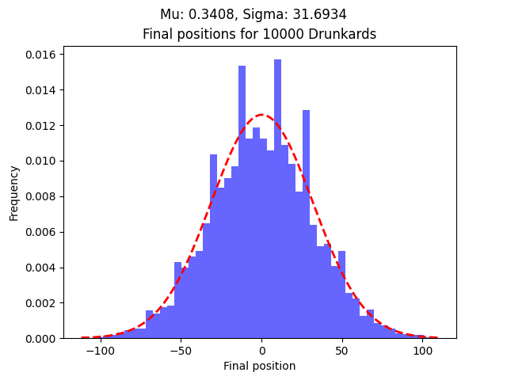
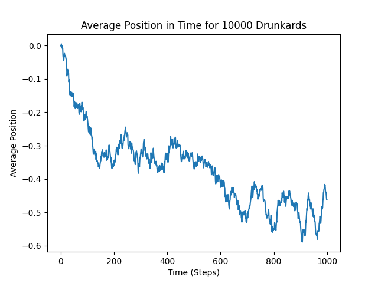
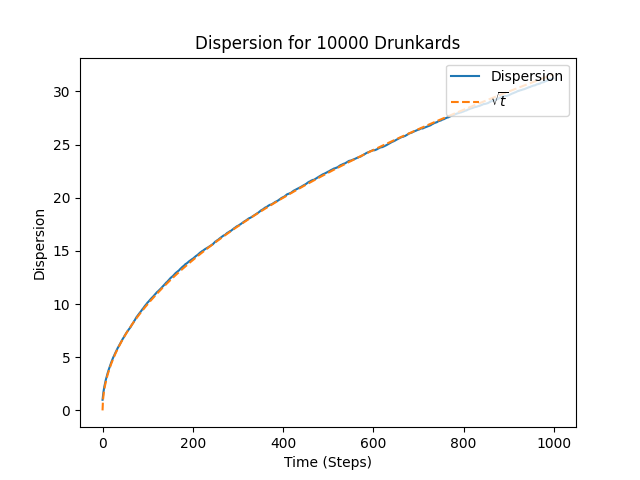

# 🍺 DrunkardWalk

This is a study repository for the classical, one-dimensional **random walk**, commonly known as the **drunkard's walk**. It's structured following OOP orientations and python module formatting. 

## Features

- Simulate a single random walker (drunkard) on a one-dimensional sidewalk;
- Run multiple simulations (walkers) in parallel to analyze ensemble behavior;
- Calculate and plot:
  - The path of a single walker;
  - The average position across multiple walkers;
  - The standard deviation across multiple walkers;
  - The final positions of multiple walkers (histogram).

---

## Structure

### Classes

- `Drunkard`: Represents a walker who moves left or right based on a coin flip.
- `Sidewalk`: Environment for a single walker.
- `City`: Simulates many walkers on their own sidewalks. Serves as basis for calculating ensemble statistics.

---

## 📈 Example Outputs

The simulation generates `.png` graphs such as:
- `AvgPos_...png`: Average position of multiple walkers over time;
- `Disp_...png`: Dispersion (standard deviation) of positions among all walkers;
- `EndPos_...png`: Histogram of ending positions of multiple walkers.

---

## Installation

The requirements will be automatically installed via ``pip``.

### Method 1

```bash
pip install git+https://github.com/OffworldAstronaut/DrunkardWalk.git
```

### Method 2

```bash
git clone https://github.com/OffworldAstronaut/DrunkardWalk
cd DrunkardWalk
pip install .
```

## Usage

### 1. Run a Single Walk Simulation

```python
sidewalk = Sidewalk(size=100, coin_p=0.5)
sidewalk.wander(end_step=1000)
sidewalk.make_wandering_plot()
```

### 2. Run a Multi-Walker Simulation

```python

# This code is on example.py

import DrunkardWalk as DW 

quantity_sidewalks = 10_000
size_sidewalks = 100
coin_p = 0.5 
max_steps = 1_000

city = DW.City(quantity_sidewalks, size_sidewalks, coin_p)

city.roam(max_steps)

city.make_avg_graph()
city.make_std_graph()
city.make_endpos_graph(sturges=False, nbins=50)
```

### Plot Examples 

**Final positions histogram**



**Average positions plot**



**Dispersion plot**

